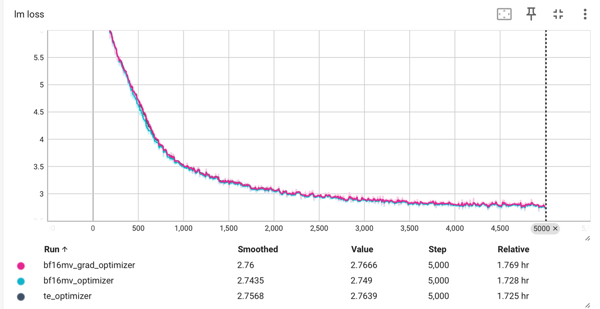
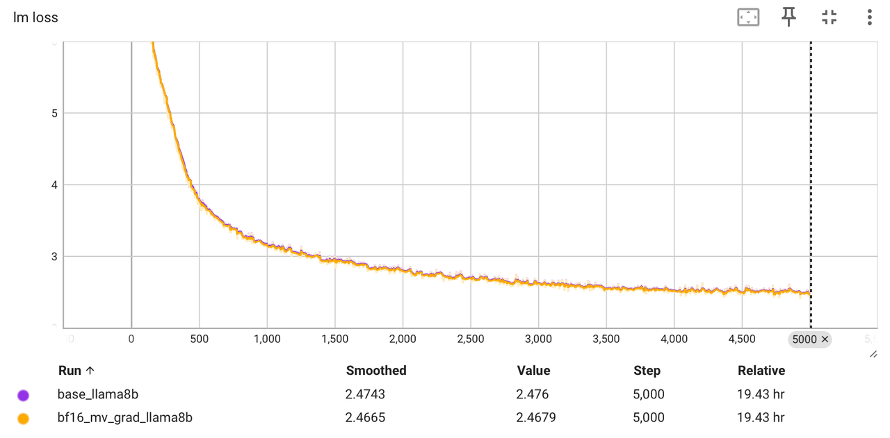
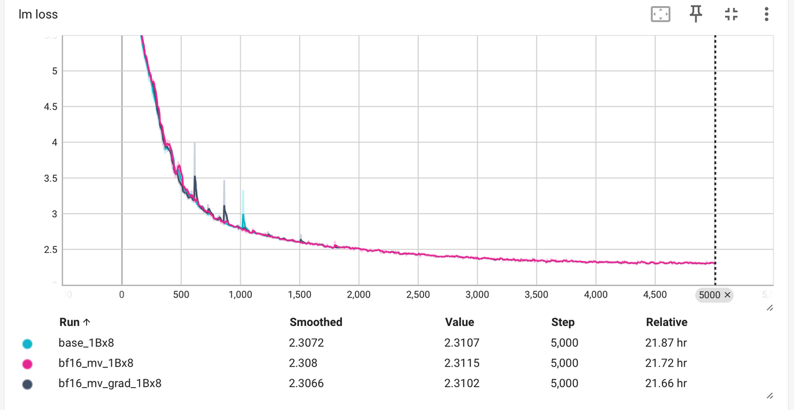

# FP8
- fp8_kernel.py，offical_kernel.py和fp8-benchmark.ipynb
- 复现fp8的核心组件，量化和矩阵乘，包括前向和反向，并进行详细对比
- 另外还实现了带ckpt的MLP

# Optimizer
- TritonAdam.py和optimizer.ipynb
- 复现optimizer，即使用bf16的1、2阶动量和fp32的grad进行混合精度训练。
## 训练Loss
- 全部使用Megatron框架
- qwen2.5-0.5B
- 
- llama3-8B
- 
- 1B*8 moe
- 

# MLA
- 如果想看MLA推理模式下实现的话，可以点我主页看另一个仓库
- 实现了权重的融合以及kv_cache的压缩存储，并使用flash-attention的模式进行计算，大大提高计算效率