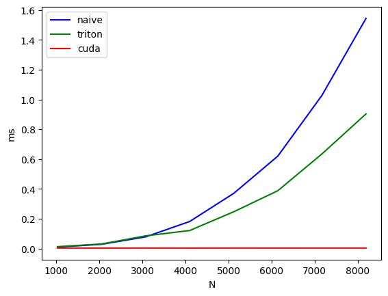

# Flash-Muon: An Efficient Implementation of Muon Optimzer
- origin repo: https://github.com/nil0x9/flash-muon.git
- I write the matmul kernel by triton. 

# Benchmark

- I test the benchmark use the following code. GPU: H200.

```python
device = "cuda"
dtype = torch.bfloat16
N = 1024
x = torch.randn(N, N*2, device=device, dtype=dtype)

data = {"dim":[], "triton":[], "torch":[], "cuda":[]}
for i in range(1, 16):
    N = i * 1024
    x = torch.randn(N, N, device=device, dtype=dtype)
    ms1 = triton.testing.do_bench(lambda: matmul_transpose(x))
    ms2 = triton.testing.do_bench(lambda: matmul(x))
    ms3 = triton.testing.do_bench(lambda: torch.matmul(x, x.t()))
    data["dim"].append(N)
    data["triton"].append(ms2)
    data["torch"].append(ms3)
    data["cuda"].append(ms1)
df = pd.DataFrame(data)
print(df)

    dim    triton      torch       cuda
0    1024  0.015140   0.010127   0.038926
1    2048  0.035008   0.028196   0.075227
2    3072  0.093735   0.078786   0.209389
3    4096  0.131490   0.182103   0.274603
4    5120  0.257187   0.388764   0.668624
5    6144  0.401960   0.659991   0.987421
6    7168  0.652907   1.038566   1.600684
7    8192  0.945991   1.612713   2.040780
8    9216  1.363409   2.252778   2.856188
9   10240  1.805552   3.073045   4.144083
10  11264  2.400649   4.177691   5.132962
11  12288  3.163356   5.295420   6.708187
12  13312  3.983519   6.739612   8.395350
13  14336  4.998694   8.884090  10.290255
14  15360  6.046372  10.737362  12.774410
```

- And I find there're some bug if I run the benchmark and plot.



```bash
muon:
        N     naive    triton      cuda
0  1024.0  0.010073  0.012151  0.003139
1  2048.0  0.028228  0.030456  0.002796
2  3072.0  0.078057  0.084861  0.003088
3  4096.0  0.181412  0.120780  0.002789
4  5120.0  0.370362  0.246647  0.003091
5  6144.0  0.620314  0.388048  0.003050
6  7168.0  1.027804  0.634725  0.003075
7  8192.0  1.544641  0.903523  0.003065
```