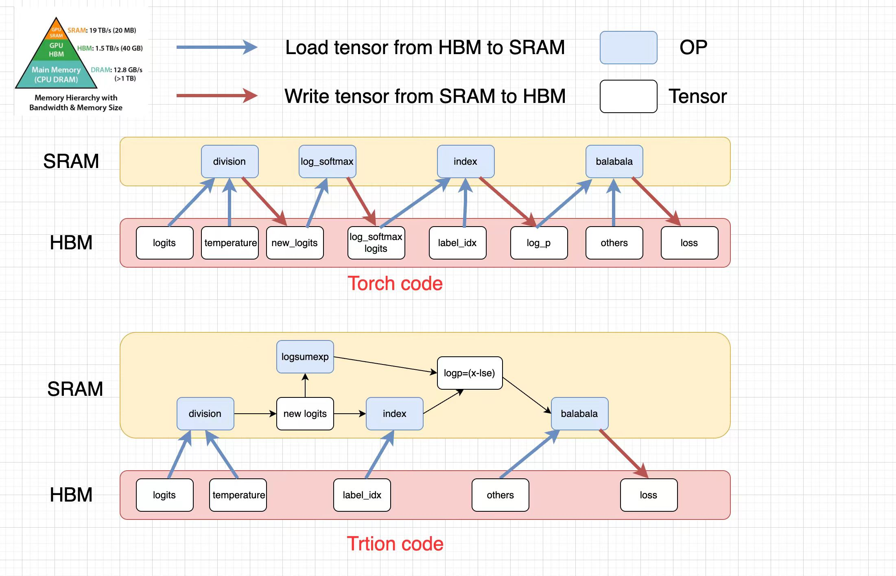
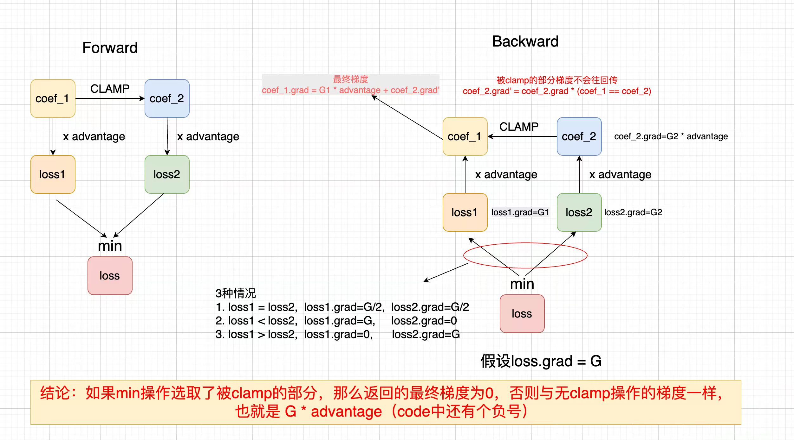

# Install 

Please be careful for the code, pay attention to the log. If you find the log is not normal or find a bug, tell me the issues

```bash
pip install .
```
# Quick start

The TRL version must be 0.16. Add it to the first line of `grpo.py` in `open-r1`.

```python
from triton_grpo_loss import patch
patch(STEP=1)
```

Note:
- The value of `STEP` is a trade-off between memory and speed. You can set `STEP` = 0, 1, 2, 3 .... micro_batch_size.
- It split a micro batch into many chunks, each chunk size is `STEP`. 
- It only run a chunk forward and backward one time. So it can ruduce lot's of memory.
- If you use small `STEP`, you will save much memory and sacrifice a little speed. Also you can add `--gradient_checkpointing false`.

# Training

## Reward(Training now)
 

## Memory
 

# Decouple compute logp and loss
- Thanks for You Jiacheng's advice. Now I split origin `grpo_loss` into 2 kernels. One is compute the logp and another is compute the loss.
- If you want use a custom loss. See the example in `triton_grpo_loss/decouple_logp_and_loss.py`. You just need to change the `compile_grpo_loss` function. Then replace `triton_grpo_loss` function in `triton_grpo_loss/run_bs_one_by_one.py`

# Why save lots of memory

- the diffenence between torch code and titon code

 

# The Grad of Clamp OP

 


