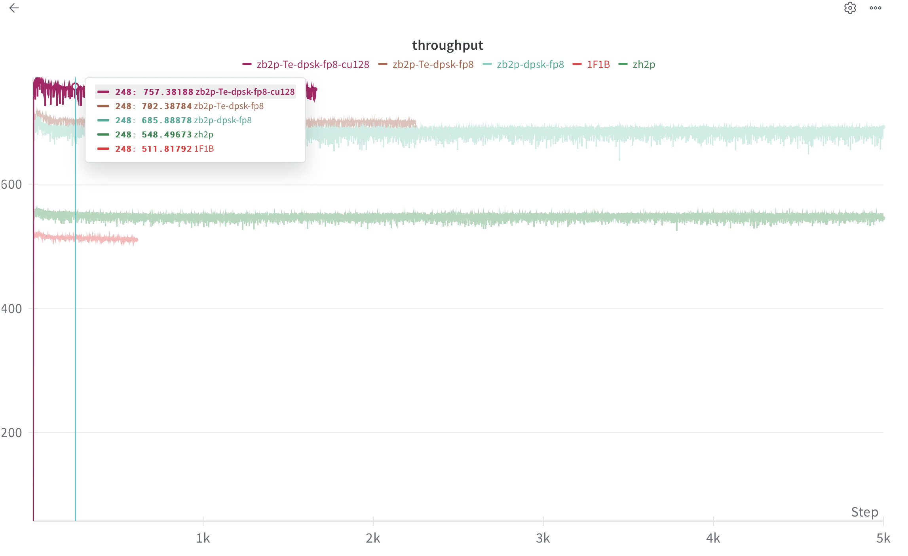

# 替换megatron中的一些模块

- swiglu
- cross-entropy-loss
- bf16一阶二阶动量的Adam
- 使用Deepseek deep_gemm 的TELinear，（解藕了wgrad可配合任何zerobubble调度, 既可fp8也可以bf16）
- 流水线并行zb2p
- 将TE中的flash-attention使用更高版本的FA2和FA3

# 吞吐量

- llama 8B，pp=4，dp=2。seq_len=4096, micro_bs=2, global_bs=256。GPU: H200


# Install

- 我的版本是CUDA12.8
```bash
# instal torch
pip3 install torch torchvision torchaudio --index-url https://download.pytorch.org/whl/cu126

# install apex
git clone https://github.com/NVIDIA/apex
cd apex
# 去setup.py文件，将check_cuda_torch_binary_vs_bare_metal函数中的cuda版本检测注释掉
pip install -v --disable-pip-version-check --no-cache-dir --no-build-isolation --config-settings "--build-option=--cpp_ext" --config-settings "--build-option=--cuda_ext" ./

# install flash-attn
git clone https://github.com/Dao-AILab/flash-attention.git
cd flash-attention
python setup.py install
cd hopper
python setup.py install

# install transformer_engine
pip install transformer_engine[pytorch]==1.13

# install deep gemm
git clone --recursive git@github.com:deepseek-ai/DeepGEMM.git
python setup.py develop
```

# 使用方法

- 将patch文件夹放到**Megatron-LM**文件夹下
- 在**pretrain_gpt.py**的第一行加入：
```python
from megatron_patchs import patch
patch(zb2p=True, dpsk_fp8=True)
```
- 如果使用bf16mv的adam时，启动脚本加入
```bash
    --use-distributed-optimizer
    --use-precision-aware-optimizer
    --exp-avg-dtype fp16
    --exp-avg-sq-dtype fp16
    --main-grads-dtype bf16
```
- 如果使用dpsk fp8时，启动脚本不要开启fp8参数，在patch函数进行设置即可