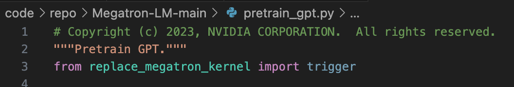

# 1. Replace Kernel 
## 文件
- replace_megatron_kernel.py
- 如果只替换部分，自行注释掉末尾的部分即可

## 作用
- 替换megatron中的swiglu，计算速度更快；替换megatron的cross_entropy_loss，速度更快，更省显存；替换transformer_engine中的optimizer，支持bf16的1、2阶动量，更省显存。

## 使用方法
- 将该文件放到Megatron-LM文件夹下，在指定运行脚本（例如：pretrain_gpt.py）中进行import，请注意，该import一定要放到最前面，否则提前导入了某些模块，该脚本会失效

- 启动脚本中加入（仅针对optimizer，其它直接修改）：
```bash
--use-distributed-optimizer
--use-precision-aware-optimizer
--exp-avg-dtype fp16    # arg的检验中不允许是bf16，optimizer会检测，不是float32就转为bfloat16
--exp-avg-sq-dtype fp16 # 默认fp32
--main-grads-dtype bf16 # 梯度累计的buffer是使用fp32还是bf16，默认fp32
```